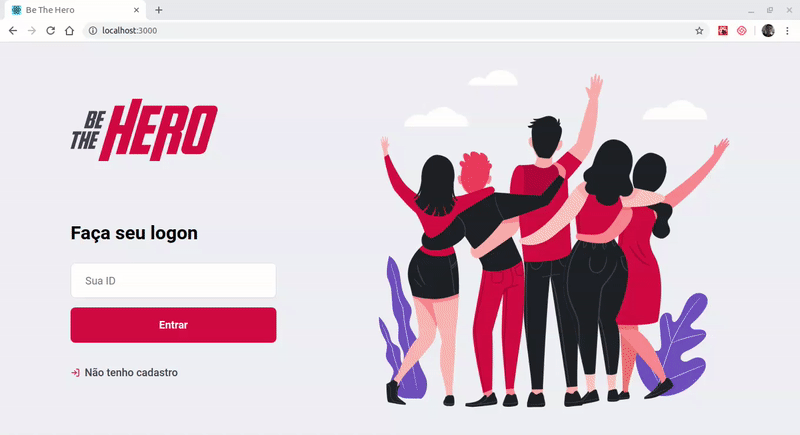
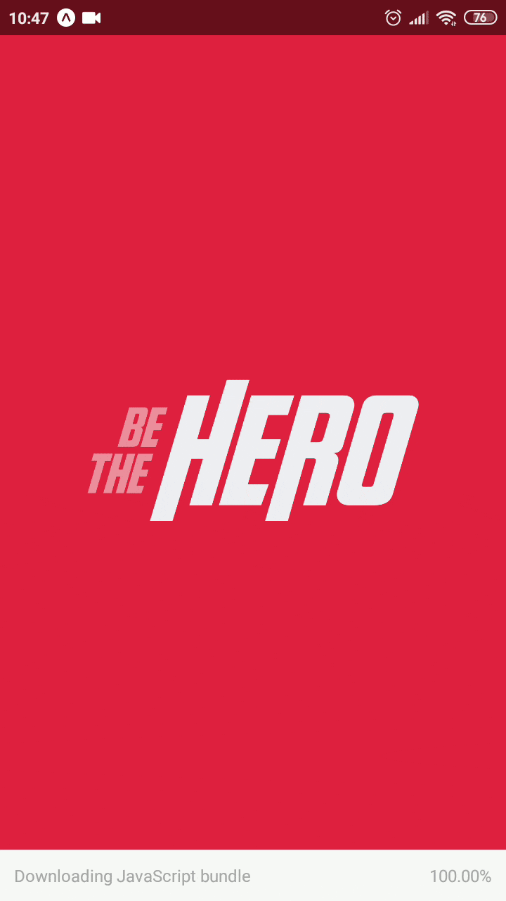

<h1 align="center">
 
  
 
 
Be The Hero
</h1>

Application to connect people interested in helping ONGs

  

  
  

## Features

This app features all the latest tools and practices in development!

- ⚛️ **React Js** — A JavaScript library for building user interfaces
- ⚛️ **React Native** — A lib that provides a way to create native apps for Android and iOS
- 💹 **Node Js** — A web framework for Node Js
- 📄 **SQLite** — A library that provides a relational database management system.

## Getting started

1. Clone this repo using `git clone https://github.com/thiagodff/Be-The-Hero`
2. Move yourself to the appropriate directory: `cd Be-The-Hero` 

### Getting started with the backend server

1. Move yourself to the backend folder: `cd backend` 
2. Run `yarn` to install dependencies 
3. Run `npx knex migrate:latest` to to setup all database 
4. Run `yarn dev` to start the server

#### Routes

### Getting started with the frontend app

1. Move yourself to the frontend folder: `cd frontend` 
2. Run `yarn` to install dependencies 
3. Run `yarn start` to start the web application

### Getting started with the mobile app

1. Move yourself to the mobile folder: `cd mobile`
2. Run `yarn` to install dependencies 
3. Run `yarn start` to start the expo bundle

obs: download expo app([ios](https://itunes.apple.com/app/apple-store/id982107779) or [android](https://play.google.com/store/apps/details?id=host.exp.exponent&referrer=www)) and scan the qr code in expo bundle to run the application in your own phone

## License

This project is licensed under the MIT License - see the [LICENSE](https://opensource.org/licenses/MIT) page for details.

---

Made with ❤️ by <strong>Thiago</strong> :wave: <a href="https://www.linkedin.com/in/thiago-fernandes-dornelles">See my linkedin!</a>
